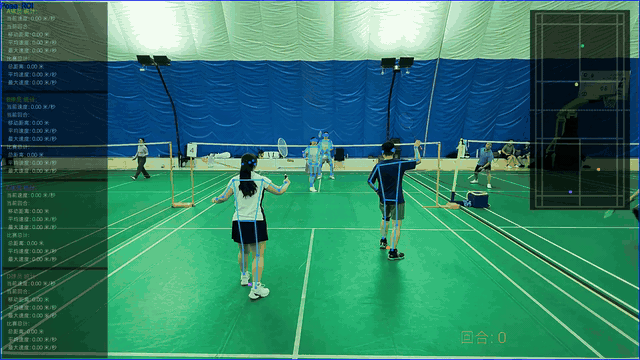

<div align="center">

# 🏸 BadCoach-AI

### Adaptive Singles/Doubles Badminton Match Video Analysis

[](https://github.com/optomao/BadCoach-AI)
[](https://www.python.org/)
[](web/frontend/)
[](web/api/)
[](LICENSE)

**A local-first computer-vision toolkit with adaptive singles/doubles player tracking, pose detection, shuttlecock tracking, court mapping, and match replay analytics.**

[中文](README.md) · [Quick Start](#-quick-start) · [Web Demo](#-web-demo) · [Preview](#-preview) · [Roadmap](#-roadmap)

</div>

---

## ✨ Overview

**BadCoach-AI** is designed for badminton training, match review, and computer-vision research. Feed it a match video, calibrate the four court corners once, and it auto-detects singles or doubles mode, then produces annotated video, court trajectories, per-player movement statistics, and structured detection data.

The system supports singles (players A/B) and doubles (players A/B/C/D) modes, with auto-detection via 30-frame warmup or manual override. Each player gets an independent stats panel showing distance, speed, rally count, and more.

> Based on [AI-YuJian-AI](https://github.com/lzylovec/AI-YuJian-AI) (Feather-Eye), originally created by [lzylovec](https://github.com/lzylovec).

## 🎬 Preview

<div align="center">



*Full demo video: [assets/demo.mp4](assets/demo.mp4)*

</div>

| Player position heatmap | Player position scatter plot |
| :---: | :---: |
|  |  |


### Video Panel Layout

Stats panels are stacked in a single column on the right side of the frame, not overlapping the court area:

- **Singles**: Player A (upper) + Player B (lower), 2 panels
- **Doubles**: Players A/B (upper) + C/D (lower), 4 auto-scaled panels

## 🧭 Two ways to use it

| Entry point | Best for | Start with |
| :--- | :--- | :--- |
| **Python CLI** | Single videos, parameter tuning, and scripts | `python main.py --video-path ...` |
| **Local Web Demo** | Uploading, clipping, calibration, job history, and downloads | FastAPI `8000` + Vite `5173` |

## 🚀 Quick Start

### Requirements

- Python 3.11+
- FFmpeg available in `PATH`
- NVIDIA GPU recommended; CPU is supported but considerably slower
- The default dependency file installs CPU builds of PyTorch and ONNX Runtime

### Install

```bash
git clone https://github.com/optomao/BadCoach-AI.git
cd BadCoach-AI

python -m venv .venv

# Windows PowerShell
.\.venv\Scripts\activate

# Linux / macOS
source .venv/bin/activate

python -m pip install --upgrade pip
pip install -r requirements.txt
```

### Prepare model weights

Model weights are not committed to the repository. Place the following files under `weights/`:

```text
weights/
├── yolo11s-ball.pt                                    # Shuttlecock detection (required)
├── yolo11n-pose.pt                                    # YOLO Pose fallback model
├── yolox_tiny_8xb8-300e_humanart-6f3252f9.onnx        # RTMPose lightweight detector
├── yolox_m_8xb8-300e_humanart-c2c7a14a.onnx           # RTMPose balanced detector
├── rtmpose-s_simcc-body7_pt-body7_420e-256x192-acd4a1ef_20230504.onnx  # RTMPose lightweight
├── rtmpose-m_simcc-body7_pt-body7_420e-256x192-e48f03d0_20230504.onnx   # RTMPose balanced/performance
├── rtmo-s_8xb32-600e_body7-640x640-dac2bf74_20231211.onnx   # RTMO lightweight
├── rtmo-m_16xb16-600e_body7-640x640-39e78cc4_20231211.onnx  # RTMO balanced
└── rtmo-l_16xb16-600e_body7-640x640-b37118ce_20231211.onnx  # RTMO performance
```

> If ONNX files are missing, `rtmlib` will download them on demand. The first run may require download time.

### Run the CLI

```bash
# Analyze with default settings (RTMPose balanced + auto singles/doubles detection)
python main.py --video-path videos/demo.mp4

# Specify match type
python main.py --video-path videos/demo.mp4 --match-type doubles

# Select a pose model
python main.py --video-path videos/demo.mp4 --pose-family rtmpose --pose-mode balanced
python main.py --video-path videos/demo.mp4 --pose-family rtmo --pose-mode lightweight
python main.py --video-path videos/demo.mp4 --pose-family yolo-pose --yolo-pose-model yolo11n-pose.pt

# English visualization text
python main.py --video-path videos/demo.mp4 --language en
```

On the first run:

1. Without `--template-path`, a file picker opens. Choose a frame where the court is clearly visible.
2. In the calibration window, click **top-left → top-right → bottom-right → bottom-left**.
3. The annotation is cached at `results/<video_name>/court_annotations.txt` and reused later.

## 🖥️ Web Demo

The Web Demo is a local workbench. Uploaded videos are stored under local `storage/`, and analysis results are written to local `results/`; no cloud service is required.

### Start the backend

```bash
pip install -r requirements.txt -r web-requirements.txt
python -m web.api.run
```

Backend: <http://127.0.0.1:8000>

### Start the frontend

In another terminal, using the same virtual environment:

```bash
cd web/frontend
npm install
npm run dev
```

Frontend: <http://127.0.0.1:5173>

The Web Demo supports:

- Video upload and preview
- Start/end clipping before analysis
- Match type selection: **Auto / Singles / Doubles**
- Pose model selection: RTMPose / RTMO / YOLO Pose
- Four-point court calibration in the browser
- Real-time scrolling log panel with live FPS and progress percentage
- Queued, running, completed, and failed job states
- Annotated video, heatmap, and scatter plot preview
- Artifact downloads, local history, and task deletion

## 🧠 Features

### Key Improvements (over the original project)

- **Adaptive singles/doubles tracking**: 30-frame warmup auto-detects max players per side; ≥2 per side → doubles. Manual override supported (auto / singles / doubles).
- **A/B/C/D slot model**: Singles = A (upper) + B (lower), Doubles = A/B (upper) + C/D (lower). Each slot has independent color, stats, and records.
- **Nearest-neighbor slot matching**: Within a side, detections are matched to slots by distance, preventing target escape during player occlusion.
- **Ghost-hold mechanism**: When a player is briefly lost (≤0.5s), the last position is retained with zeroed speed, preventing panel flicker.
- **RTMPose as default detector**: Fixed YOLOX detector input sizes (yolox_tiny=416, yolox_m=640), all RTMPose/RTMO model weights included.
- **Alibaba PuHuiTi font**: All Chinese visualizations (video panels, heatmaps, scatter plots) use Alibaba PuHuiTi, eliminating garbled text.
- **Panel layout fix**: Stats panels stacked in a single right-side column, doubles 4 panels auto-scaled without overlap, rally count moved to bottom-left.
- **Real-time performance monitoring**: Web Demo frontend shows scrolling logs, live FPS, and progress percentage.
- **Performance benchmarking tools**: `benchmark_pose.py` and `benchmark_compare.py` for per-stage profiling.

### Vision pipeline

- **Player pose detection** with RTMPose (default), RTMO, and Ultralytics YOLO Pose.
- **Shuttlecock detection** with YOLO and cross-frame trajectory overlays.
- **Court coordinate mapping** through four-point perspective transformation to standard court coordinates.
- **Player tracking** with adaptive A/B (singles) or A/B/C/D (doubles) slot-based tracking.
- **Rally detection** based on continuous court-view segments, with rally IDs in overlays and records.

### Results and analytics

- **Per-player motion statistics**: distance, instant speed, average speed, maximum speed, and rally count.
- **Position plots**: per-player heatmaps and scatter plots, with legends moved to court plot upper-left to avoid stats panel collision.
- **Configurable overlays**: pose ROI, skeletons, player trajectories, court trajectory, shuttle trajectory, and stats panel.
- **Structured export**: `metadata.json` (with `match` section), `session_summary.json`, and per-frame `detections.jsonl` (schema 1.1, with `match_mode` and A/B/C/D slot keys).
- **Bilingual visualization** through `--language zh/en`.

## 🏗️ Processing pipeline

```text
Match video
    │
    ├── Warmup auto-detection (first 30 frames) → singles/doubles
    ├── Player pose detection (RTMPose / RTMO / YOLO Pose)
    ├── Shuttlecock detection (YOLO)
    └── Four-point court calibration
           │
           ▼
    Perspective transform: image → standard court coordinates
           │
           ▼
    Slot matching (nearest-neighbor) → A/B (singles) or A/B/C/D (doubles)
           │
           ▼
    Player tracking, rally detection, speed and distance statistics
           │
           ├── Annotated MP4 (right-side panels, Alibaba PuHuiTi font)
           ├── Heatmap / scatter plot (legend in upper-left)
           └── JSON / JSONL structured data (schema 1.1)
```

## ⚙️ Common options

| Flag | Description | Default |
| :--- | :--- | :--- |
| `--video-path` | Input video (required) | — |
| `--match-type` | Match mode: `auto` / `singles` / `doubles` | `auto` |
| `--output-dir` | Output directory | `results/<video_name>` |
| `--ball-model` | Shuttlecock model path | `weights/yolo11s-ball.pt` |
| `--pose-family` | `rtmpose` / `rtmo` / `yolo-pose` | `rtmpose` |
| `--pose-mode` | `lightweight` / `balanced` / `performance` | `balanced` |
| `--yolo-pose-model` | YOLO Pose path or model name | `yolo11n-pose.pt` |
| `--template-path` | Court template image | file picker |
| `--display` | Show OpenCV preview | `true` |
| `--skeletons` | Draw player skeletons | `true` |
| `--player-trajectories` | Draw player trajectories | `true` |
| `--court-trajectory` | Draw court trajectory | `true` |
| `--shuttlecock-trajectory` | Draw shuttle trajectory | `true` |
| `--player-stats` | Show player stats panel | `true` |
| `--visualize-positions` | Generate heatmap and scatter plot | `true` |
| `--audio` | Keep original audio | `true` |
| `--language` | Visualization language: `zh` / `en` | `zh` |
| `--save-images` | Save per-frame images | `false` |
| `--performance-stats` | Print performance timing | `false` |

## 📦 Output

The CLI writes to `results/<video_name>/` by default:

```text
results/<video_name>/
├── metadata.json                  # video, model, calibration, match mode, and output metadata
├── detections.jsonl               # per-frame detection records (schema 1.1, A/B/C/D slots)
├── detect_<video_name>.mp4        # annotated video with overlays and stats
├── court_annotations.txt          # CLI four-point calibration cache
└── position_visualizations/
    ├── heatmaps/                  # per-player position heatmaps
    └── scatter_plots/             # per-player position scatter plots
```

### Performance benchmarking

```bash
# Single-stage performance analysis
python benchmark_pose.py

# Multi-mode comparison (RTMPose / RTMO / YOLO11n-pose)
python benchmark_compare.py
```

## 🧩 Project structure

```text
BadCoach-AI/
├── main.py                       # CLI entry point
├── benchmark_pose.py             # Single-stage performance benchmark
├── benchmark_compare.py          # Multi-pose-mode comparison benchmark
├── badminton_analysis/           # core video-analysis pipeline
│   ├── court/                    # court calibration and mapping
│   ├── data/                     # JSON / JSONL persistence
│   ├── detection/                # pose and shuttlecock detection (RTMPose / RTMO / YOLO Pose)
│   ├── media/                    # video and audio processing
│   ├── tracking/                 # player tracking (adaptive A/B/C/D slots)
│   └── visualization/            # overlays and charts (Alibaba PuHuiTi font)
│       └── fonts/                # font files
├── web/
│   ├── api/                     # FastAPI job service
│   └── frontend/                # React + Vite frontend
├── assets/                      # demo GIF, video, and sample images
├── templates/                   # court template images
├── videos/                      # sample input videos
├── weights/                     # model weights (gitignored)
├── requirements.txt             # analysis dependencies
└── web-requirements.txt         # Web backend dependencies
```

## 📊 Performance Reference

CPU mode (1280x720 video, RTMPose balanced):

| Method | Per-frame | FPS | Persons |
| :--- | :--- | :--- | :--- |
| RTMPose balanced | ~554ms | 1.8 | 10 |
| RTMPose lightweight | ~265ms | 3.8 | 12 |
| RTMO balanced | ~178ms | 5.6 | 1 |
| RTMO lightweight | ~87ms | 11.6 | 1 |
| YOLO11n-pose | ~69ms | 14.6 | — |

> GPU acceleration (onnxruntime-gpu + CUDA) expected to yield 10-20x speedup.

## 🔮 Roadmap

- [x] Frame-by-frame badminton match video analysis
- [x] RTMPose / RTMO / YOLO Pose support
- [x] YOLO shuttlecock detection
- [x] Manual court calibration and coordinate mapping
- [x] Player trajectory, speed, distance, and rally statistics
- [x] Heatmaps, scatter plots, and structured data export
- [x] Local Web Demo for upload, calibration, queued analysis, and downloads
- [x] **Adaptive singles/doubles tracking (A/B/C/D slots)**
- [x] **Manual match type selection (auto / singles / doubles)**
- [x] **Alibaba PuHuiTi Chinese visualization**
- [x] **Real-time FPS and progress monitoring**
- [x] **Performance benchmarking tools**
- [ ] More stable hit-point recognition
- [ ] More accurate shuttlecock detection
- [ ] More complete stroke statistics
- [ ] Automatic court keypoint detection
- [ ] Batch video analysis workflow
- [ ] GPU acceleration support

## 🛠️ Tech stack

<p>
  
  
  
  
  
  
  
  
</p>

## 🙏 Acknowledgements

- [AI-YuJian-AI](https://github.com/lzylovec/AI-YuJian-AI) (Feather-Eye): This project is a secondary development based on this open-source project, originally created by [lzylovec](https://github.com/lzylovec)
- [TrackNetV2](https://github.com/wywyWang/TrackNetV2): badminton dataset-related work
- [RTMPose](https://github.com/open-mmlab/mmpose): human pose estimation
- [Ultralytics YOLO](https://github.com/ultralytics/ultralytics): detection ecosystem
- [Alibaba PuHuiTi](https://fonts.alibabagroup.com/): Chinese visualization font

## 📄 License

Project code is released under the [Apache License 2.0](LICENSE). Model weights are not committed to this repository; follow the license and attribution requirements of each upstream project when downloading or redistributing them.

---

<div align="center">

If this project helps you, a ⭐ would be appreciated.

**Made with ❤️ by [optomao](https://github.com/optomao)**

</div>
